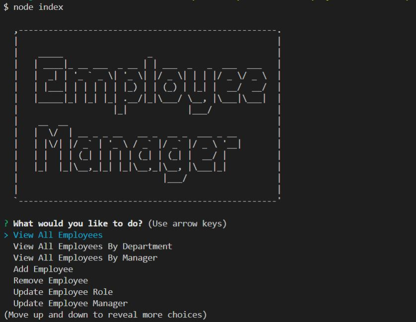

# Employee Tracker

This is a command line application that allows users to manage employee status and information when node index is used in the command line.

GitHub Repository: https://github.com/Toccara/12employee-tracker
